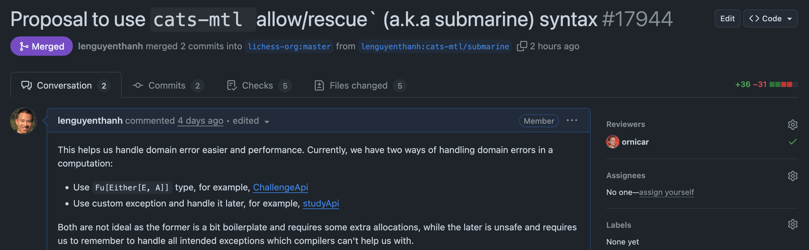

### Rethinking Monad Transformers with Raise Capability

Thanh Le

20-08-2025

Note:
- so, hello I'm really excited to present to you a solution for error handling which is a monadic embedding of capabilities based on top of cats, and cats-mtl library, which basically removing the need of monad transformers or nested Either for typed error handling

- And my goal is that you find it useful and once you walk out of this room, you will be able to use it in your own projects. So I expect a lot of pull requests in different projects tonight.

---

## Disclaimer

- Credits go to the Daniel Spiewak
- Scala 3 syntax, but Scala 2 is also supported
- Focus IO (and Future) effect

Note:
Some quick disclaimers before we start:
- I want to give full credit to Danial Spiewak and Arman Bilge for their original idea, and all the support and reviews they gave me during the development time.
- Focus on monofuntor effect system like IO or Future.
- Other effect system ZIO or Kyo have their own unique solution, so this probably doesn't apply to them
- then you can apply this technique right away without much effort.
- this is my first time giving a talk in English and in a conference, and I'm extremely nervous so I want thank you for coming here and being patient with me.
- And I also know that I'm the last obstacle between you and the beer so I really really hope you will find it worthwhile.

---

## About me

- Born and raised in Vietnam
- Live in Sweden and work at Recorded Future
- Love functional programming and performance optimization
- Maintainer of some open source projects, most notably lichess.org
- Chess & calisthenics

Note:
- So I have abstraction and performance optimization
- I'm not thibault - the creator of lichess, a lot of people mistaken me to him, but in reality I'm not. So I hope to set the record straight for once and for all.
- I swear can do some l-sit, my next goal is to do a handstand

---

## Outline

- Motivation
- Introduce our case study
- Different techniques of error handling in Scala
  - Untyped Errors
  - Typed Errors with nested Either
  - EitherT monad transformer
  - Monadic embedding of capabilities using cats-mtl
- Under the Hood (briefly)

Note:

- So, the way I structure this talk, is in the first section of the talk, I will introduce the different kinds of errors and motivation for this talk.
- And I will walk you through a case study to show you different techniques of error handling.
- Which goes from untyped to typed errors with nested Either or with EitherT monad transformer and finally the monadic embedding of capabilities.

- As Martin mentioned in yesterday keynote, we already can express capabilities in Scala, and here is how we express them in a monadic context without the experimenatl capture-checking feature. that means we can use it in production right away. And for a side note, there are some work on adding more capabilities directly on cats-effect IO. So this is a first step towards that direction.

- At the end of the talk, if we have time, I will show some Scala 3 features and techniques that we utilize to make this submarine technique as no-cost syntax. I think this is really cool as usually in order to write simple code, we need more abstractions (which is true in this case as well), and with more abstractions, we usually suffer from performance overhead, but with some unique Scala 3 features, such as inline and context functions, we can make this technique powerful yet performant.

---

## Errors and exceptions

There are three kinds of errors

- Domain specific errors
- System errors
- Bugs

Note:
- In general, we can categorize errors into three kinds
- Domain specific errors are documented edge cases in our business logic, and We want to give specific feedback to users when these errors happen
- System errors are unexpected, purely technical failures, such as network failure, database connection failure, etc. We may to log them, alert them, trying to restart the system and notify the user that something went wrong. But there are nothing we or users can do about it.
- And bugs, we don't want them but we can't avoid them either. The only thing we can do is not to ignore or hidden them with other errors. So we can fix them as soon as possible.
- So, we need to distinguish between those kinds of errors, and we want to handle them differently.
- And in this talk, I will focus on domain specific errors, and how we can deal with them in a safe, simple and performant way.

---

## Motivation

- Safe
- Simple & concise
- Performant

Note:
- My motivation for this talk is really simple, I (and I hope all of us as well) always want to write code that safe, simple and performant.
- And that is even more important when it comes to error handling, because error handling is a crucial part of our code, because once we know how handle them in
a safe and simple way, we can focus most of our energy on the business logic go get the job done.
- And in the real world, because of our limited time and resources, we often accept to write code that is not safe for the sake of simplicity and performance.
- So I hope that with a this new technique, we don't have to sacrifice any of those properties anymore.

- If an error is a domain specific error, model it as a type
- Error types appear in the function signature
- Compiler is able to tell to handle all possible errors that we're supposed to handle

---

## Case study: accept a game challenge


Note:
- For the rest of this presentation, I will use a simple case study to walk you through different techniques of error handling and highlight the differences of those.
- So, let's start with our case study, which is to accept a game challenge. Here is a screentshot I took from lichess.org few days a go. You can see that there is a challenge from a user to another users. And in this case if I want to accept this challenge, I'll need to click to the green button there. And our use case is about what happen from when users click on that button, to when the game is created.

--

### Case study: accept a game challenge



Note:
- And this is a simplified version that I encounter at lichess lila where I had pull request that apply the new cats-mtl technique.
- PR is quite small, it only touches a few lines of code,
- we can use it as drop-in replacement for the existing code.
- And as you can see It was merged and been running in production ever since.

--

### Case study: accept a game challenge

```scala [1-100]
def acceptChallenge(id: ChallengeId): IO[Game] =
  for
    challenge <- find(id)
    _ <- accept(challenge)
    game <- create(challenge)
  yield game

// Challenge must exist
def find(id: ChallengeId)       : IO[Challenge]
// challenge must be active
def accept(challenge: Challenge): IO[Unit]
// Can only play one game at a time
def create(challenge: Challenge): IO[Game]
```

Note:

We want a function to help our players accept a challenge to play a game using a challengeId. The function should return a newly created Game for players in case of success, and it also has enforce some business rules, such as:

- Each step of the process is a potential source of errors. And since there is a lot of external data fetching, IO will be necessary here, or other effect types

- by the way, If you are not familiar with IO cats-effect, it's also fine just mentally replace IO with Future, the idea is the same and the code will still work, mhh probably with some minor adjustments, like some extra import, but will stay mostly the same.


--

### Case study: accept a game challenge

```scala [10-12]
// business logic
def acceptChallenge(id: ChallengeId): IO[Game] =
  for
    challenge <- find(id)
    _ <- accept(challenge)
    game <- create(challenge)
  yield game

// Usage, for example in service/API layer
acceptChallenge("challenge", "user")
  .flatMap: game =>
    IO.println(s"Challenge accepted, game created: $game")
```

---

### Untyped Errors

```scala [1-2, 5-8, 11-12]
case class NotFound(id: ChallengeId)
    extends RuntimeException(s"Challenge with id $id not found")
def find(id: ChallengeId): IO[Challenge]

case class IsDeclined(id: Challenge)
    extends RuntimeException(s"Challenge $id is not for user $playerId")
case class IsCancelled(id: ChallengeId)
    extends RuntimeException(s"Challenge $id is canceled")
def accept(challenge: Challenge): IO[Challenge]

case class CreateGameError(message: String)
    extends RuntimeException(message)
def create(challenge: Challenge): IO[Game]
```

--

### Untyped Errors

```scala [4-12]
acceptChallenge("challenge", "user")
  .flatMap: game =>
    IO.println(s"Challenge accepted, game created: $game")

acceptChallenge("challenge", "user")
  .flatMap: game =>
    IO.println(s"Challenge accepted, game created: $game")
  .recoverWith:
    case NotFound(id) => IO.unit
    case IsDeclined(challenge) => IO.unit
    case CreateGameError(message) => IO.unit
```

Note:
- With this approach, we keep the implementation of acceptChallenge the same but in the callsite, we need to handle all possible exceptions that can be thrown.

--

### Untyped Errors

```scala [7]
acceptChallenge("challenge", "user")
  .flatMap: game =>
    IO.println(s"Challenge accepted, game created: $game")
  .recoverWith:
    case NotFound(id) => IO.unit
    case IsDeclined(challenge) => IO.unit
    case IsCancelled(id) => IO.unit
    case CreateGameError(message) => IO.unit
```

--

### Untyped Errors

```scala [9]
acceptChallenge("challenge", "user")
  .flatMap: game =>
    IO.println(s"Challenge accepted, game created: $game")
  .recoverWith:
    case NotFound(id) => IO.unit
    case IsDeclined(challenge) => IO.unit
    case IsCancelled(id) => IO.unit
    case CreateGameError(message) => IO.unit
    case _ => IO.unit // catch all other exceptions
```

--

### Untyped Errors

- There is no exhaustive check for pattern matching
- We cannot distinguish between different kinds of errors
- Exceptions are hidden from the function signature

--

### How do we know what exceptions can be thrown?

- Read documentation
- Read the implementation and figure it out.
- Run the code and see what it actually throws (or our users)

Note:
- Imagine when you're writing program above, how do you know what kinds of exceptions `accept` is going to throw, and which one to catch? There's three possible approaches to figuring this out:

- You read the error conditions in the Scaladoc or usage docs. In practice this is almost never specified in docs (and, if it’s worth putting error conditions in the documentation, why isn’t it worth putting them in the type?)

- You dig into the implementation and figure it out. Fun. because in the real world, we don't have just only three functions to look at, we have more, and each functions will need to call other functions as well, so we have layers on top of layers to figure out which exceptions we need to handle.

- You run the code and figure out what it actually throws. It's not hard to think of scenarios where this is extremely difficult to do.

- I believe this is what most of people do in practice, But I also believe this is ok if you writing in python, or javascript or any other dynamic language, but in scala we have more powerfull features to help us with this problem. And we can start by modeling our errors as types

--

### Conclusion for Untyped Errors

- ~Safe~
- ~Simple and concise~
- Performant

Note:

- So untyped errors are definitely not safe, it requires tremendous discipline to use them correctly.
- Even though this looks simple in the surface but it is hidden so many pitfalls.
- I think we can say that it's easy but not simple
- So lets go to the next technique which is typed errors with nested Either.

---

#### Typed errors with nested Either

```scala [1-8, 10]
// Look Ma, no more RuntimeException here!
case class NotFound(id: ChallengeId)

enum AcceptError:
  case IsDeclined(challenge: Challenge)
  case IsCanceled(id: ChallengeId)

case class CreateGameError(message: String)

type Error = NotFound | AcceptError | CreateGameError
```

Note:
- Now we convert all of our exception to normal case classes or enums
- You can notice that we don't extends RuntimeException anymore.
- Also these errors are not depend on each other as well,
- like we can imagine that we each of these errors come from different modules or different libraries
- So that why we now have an union type `Error` here to represent all possible errors that can happen our program

--

#### Typed errors with nested Either

```scala [1-3, 12-19]
def find(id: ChallengeId):        IO[Either[NotFound, Challenge]]
def accept(challenge: Challenge): IO[Either[AcceptError, Unit]]
def create(challenge: Challenge): IO[Either[CreateGameError, Game]]

def acceptChallenge(id: ChallengeId): IO[Either[Error, Game]] =
  for
    challenge <- find(id)
    result <- accept(challenge)
    game <- create(result)
  yield game

acceptChallenge("challenge", "user")
  .flatMap:
    case Right(game) =>
      IO.println(s"Challenge accepted, game created: $game")
    case Left(NotFound(id)) => IO.unit
    case Left(IsDeclined(challenge)) => IO.unit
    case Left(IsCanceled(id)) => IO.unit
    case Left(CreateGameError(message)) => IO.unit
```

Note:
- we can use `Either` to represent our errors
- And now it's clear for us that what kind of errors can happen, in each step of the process.
- And we have to handle them accordingly.

--

#### this does not compile :cry:

```scala [1-100]
// We can't compose many IO[Either[A, B]] together
def acceptChallenge(id: ChallengeId): IO[Either[Error, Game]] =
  for
    challenge <- find(id)
    result <- accept(challenge)
    game <- create(result)
  yield game
```

--

### Let's fix it

```scala [1-100]
def acceptChallenge(id: ChallengeId): IO[Either[Error, Game]] =
  for
    challengeOrError <- find(id)
    acceptedOrError <- challengeOrError match
      case Left(error) => IO.pure(Left[Error, Unit](error))
      case Right(challenge) => accept(challenge).map(_.as(challenge))
    game <- acceptedOrError match
      case Left(error) => IO.pure(Left[Error, Game](error))
      case Right(challenge) => create(challenge)
  yield game
```

--

### Or we can do it with nested flatMap

```scala [1-100]
def acceptChallenge(id: ChallengeId): IO[Either[Error, Game]] =
    find(id).flatMap:
      case Left(error) => IO.pure(Left(error))
      case Right(challenge) =>
        accept(challenge).flatMap:
          case Left(error) => IO.pure(Left(error))
          case Right(_) =>
            create(challenge).map:
              case Left(error) => Left(error)
              case Right(game) => Right(game)
```

--

### Conclusion for typed error with nested Either

- Safe
- ~Simple and concise~
- Performant

Note:
  - Clear separation of success and error cases
  - Compiler checks for exhaustiveness in pattern matching
  - Boilerplate code for handling errors
  - Can lead to deeply nested structures if not managed properly

---

### EitherT (monad transformers)

```scala [2-9]
import cats.data.EitherT
def accept(id: ChallengeId): IO[Either[Error, Game]] =
  val eitherT: EitherT[IO, Error, Game] =
    for
      challenge <- EitherT(find(id))
      _ <- EitherT(accept(challenge))
      game <- EitherT(create(challenge))
    yield game
  eitherT.value
```

--

### Few words about EitherT

```scala
// EitherT.apply(IO[Either[A, B]]):  EitherT[IO, A, B]
// EitherT[IO, A, B].value: IO[Either[A, B]
class EitherT[F[_], A, B] private (val value: F[Either[A, B]]):
  def flatMap[C](f: B => EitherT[F, A, C]): EitherT[F, A, C] = ???
  def map[C](f: B => C): EitherT[F, A, C] = ???
object EitherT:
  def apply[F[_], A, B](value: F[Either[A, B]]): EitherT[F, A, B] =
    new EitherT(value)
```

Note:
- The EitherT is one of several monad transformers ready for us to use in Cats.
- EitherT[IO, A, B] is a light wrapper around IO[Either[A, B]]
- It supports `flatMap`, `map`, and other monadic operations that for-comprehension requires.

--

### Conclusion for EitherT

- Safe
- ~Simple and concise~
- ~Performant~

--

### Notes on EitherT and cats-effect

 - There are some limitation with concurrent code based
    - https://github.com/typelevel/fs2/issues/3199
    - https://github.com/typelevel/cats/issues/4308
    - https://github.com/typelevel/cats-effect/discussions/3765
    - https://github.com/typelevel/fs2/pull/2895
    - https://github.com/typelevel/cats-effect/issues/2448

Note:
- They work well in a few contexts, most notably local scopes (i.e. within the body of a single method), but they're generally the wrong solution for the problem.

- Quite notably, while the Cats Effect concurrent typeclasses do work on monad transformer stacks and derive lawful results, the practical outcomes can be very unintuitive. For that reason, it's generally not advisable to use types like EitherT or IorT composed together with libraries like Fs2 or similar.

- So lets see if we can do better than that.

---

### cats-mtl with Raise capability

```scala [4-17]
//> using dep org.typelevel::cats-mtl:1.6.0
import cats.mtl.Raise

def find(id: ChallengeId)(using Raise[IO, NotFound]): IO[Challenge]
def accept(challenge: Challenge)(using Raise[IO, AcceptError]): IO[Unit]
def create(challenge: Challenge)(using Raise[IO, CreateGameError]): IO[Game]

// type Error = NotFound | AcceptError | CreateGameError
def acceptChallenge(id: ChallengeId)(using Raise[IO, Error]): IO[Game] =
  for
    challenge <- find(id)
    _ <- accept(challenge)
    game <- create(challenge)
  yield game
```

Note:
- So here, instead of Either, we have using Raise[IO, NotFound], we give the find function the capabilities to raise an error of arbitrary type NotFound
- This is a bit like checked exception in Java throws NotFound exception, except it isn't an exception!
- And for acceptChallenge function, because we give it the capabilities of raising an Error, as a reminder Error is the union type of the other three errors.

--

### cats-mtl with Raise capability

```scala [2-9]
import cats.mtl.Handle
Handle.allow[Error]:
  acceptChallenge("challenge", "user").flatMap: game =>
    IO.println(s"Challenge accepted, game created: $game")
.rescue:
  case NotFound(id) => IO.unit
  case IsDeclined(challenge) => IO.unit
  case IsCanceled(id) => IO.unit
  case CreateGameError(message) => IO.unit
```

Note:
- Finally, at the end of the snippet above, we define program using the brand new syntax: allow/rescue. This is where things get very fancy. What we're doing here is we're introducing a new lexical scope (indented after the allow[Error]:) in which it is valid to raise an error of type Error. You should think of this as being very similar to try/catch, except it works with effect types like IO and any error type you define (not just Throwable). Within this scope, we write code as usual, and we're allowed to call the acceptChallenge function.
- At the end of the allow scope, we call .rescue, and this requires us to pass a function which handles any errors which could have been raised by the body of the allow. This works exactly like catch, except with your own domain error types. In this case, we are apparently just logging the existence of the errors and moving on with our life, because we do some printing and away we go, but you could imagine perhaps returning a custom HTTP error code, or triggering some fallback behavior, or really any other error handling logic.

--

### cats-mtl with Raise capability

```scala [2,3]
Handle.allow[Error]:
  acceptChallenge("challenge", "user").flatMap: game =>
    IO.println(s"Challenge accepted, game created: $game")
.rescue:
  case NotFound(id) => IO.unit
  case IsDeclined(challenge) => IO.unit
  case IsCanceled(id) => IO.unit
  case CreateGameError(message) => IO.unit
```

Note:
- Note that if we had tried to call acceptChallenge outside of this allow/rescue, it would have been a compile error informing us that we're missing the Raise capability.

--

### cats-mtl with Raise capability

```scala [1-14]
// context function
type IORaise[E, A] = Raise[IO, E] ?=> IO[A]

def find(id: ChallengeId):        IORaise[NotFound, Challenge]
def accept(challenge: Challenge): IORaise[AcceptChallengeError, Unit]
def create(challenge: Challenge): IORaise[CreateGameError, Game]

def acceptChallenge(id: ChallengeId): IORaise[Error, Game] =
  for
    challenge <- findChallenge(id)
    _ <- accept(challenge)
    game <- createGame(challenge)
  yield game
```

Note: we can make this nicer with type alias and context function

--

### cats-mtl with Raise capability

```scala [1-9]
// scala 2
allowF[IO, Error] { implicit h =>
  acceptChallenge("challenge", "user").flatMap{ game =>
    IO.println(s"Challenge accepted, game created: $game")
 }
}.rescue {
  case NotFound(id) => IO.unit
  case IsDeclined(challenge) => IO.unit
  case IsCanceled(id) => IO.unit
  case CreateGameError(message) => IO.unit
}
```

Note:
Oh, and just in case you were wondering, this syntax does work on Scala 2 as well, it's just a bit less fancy! but more braces and more explicit types

--

### Conclusion for cats-mtl

- Safe
- Simple and concise
- Performant

Note:
  - Clear separation of success and error cases
  - Compiler checks for exhaustiveness in pattern matching
  - pretty concise and readable code
  - Performance is good, comparable to exceptions based approach
- Cons:
  - Additional dependency on `cats-mtl`
  - a bit of new concepts to learn (e.g. `Raise`, `allow`, `rescue`)
  - Compilation error messages can be cryptic


--

### Some caveats

- Additional dependency on `cats-mtl`
- a bit of new concepts to learn (e.g. `Raise`, `allow`, `rescue`)
- Compilation error messages can be cryptic

---

### Under the hood

- Re-use existing abstraction from cats and cats-mtl
- Context functions (the A ?=> B syntax)
- inline functions

Note:
- By implementing this functionality without extending the number of actual error channels within the effect type ,
we ensure that everything continues to compose correctly around all resource handling,
structured and unstructured concurrency, and otherwise-oblivious generic library code which has no idea what your domain errors are or how they might behave.

---

### links

- The cats-mtl pr: https://github.com/typelevel/cats-mtl/pull/619
- PRs of using cats-mtl in lichess
  - https://github.com/lichess-org/lila-search/pull/542
  - https://github.com/lichess-org/lila/pull/17944

---

### thank you
